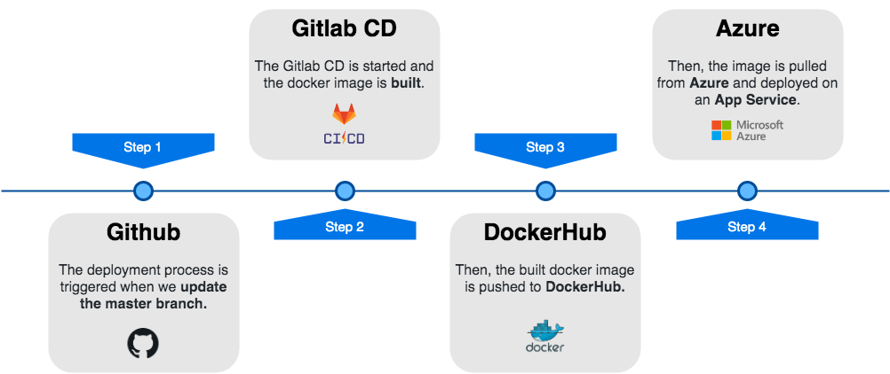

<p align="center">
  
</p>

## Download and install the project

```
$ git clone https://github.com/BREDFactory/flex-web-client.git
$ cd flex-web-client 
$ npm install 
```

## FlexOffice Server Configuration

Make sure you have filled your API environment files by editing the ```.env``` file :
(Follow these steps to have your server working :
[flex-rn-server](https://github.com/ayshiff/flex-server))

In Flex Client, be sure to have four files in the `config` directory :

`server.js` , `api.js` , `regex.js` , `places.json`

Fill in your server address in `server.js` file :

```
{
  "address": "https://myapp.herokuapp.com/api/",
  "sockets": "https://myapp.herokuapp.com/"
}
```

You'll add also the access token provided by Heroku :

Fill in your api credentials in `api.js` file :

```
{
    "email": "",
    "password": "",
    "token": "",
    "_id": ""
}
```

(For android deployment use ```10.0.2.2``` for the host)

Fill in your regexes in `regex.js` file :

```
{
    "idRegex": "",
    "placeRegex": ""
}
```

You also have to configure environment variables of the *flex server* project.
`CONFIG_REGEX`, `PLACE_REGEX`.

Fill in your place filters in `places.json` file :

```
{
    "buildingIndex": ["TestA", "TestB"],
    "buildingCodes": ["A", "B"],
    "buildings": [
        {
            "zoneCodes": ["A", "B", "C"],
            "sideIndexUpper": ["FRONT", "MIDDLE", "BACK"],
            "floorIndex": ["5th floor", "6th floor"],
            "zoneIndex": ["Zone 1", "Zone 2", "Zone 3"],
            "sideIndex": ["Front", "Middle", "Back"],
        },
        {
            "zoneCodes": ["A", "B", "C"],
            "sideIndexUpper": ["FRONT", "MIDDLE", "BACK"],
            "floorIndex": ["5th floor", "6th floor"],
            "zoneIndex": ["Zone 1", "Zone 2", "Zone 3"],
            "sideIndex": ["Front", "Middle", "Back"],
        }
    ]
}
```

## Available Scripts

### `npm start`

Runs the app in the development mode.<br>
Open [http://localhost:3000](http://localhost:3000) to view it in the browser.

### `npm test`

Launches the test runner in the interactive watch mode.<br>
See the section about [running tests](https://facebook.github.io/create-react-app/docs/running-tests) for more information.

### `npm run build`

Builds the app for production to the `build` folder.<br>
It correctly bundles React in production mode and optimizes the build for the best performance.

The build is minified and the filenames include the hashes.<br>
Your app is ready to be deployed!

See the section about [deployment](https://facebook.github.io/create-react-app/docs/deployment) for more information.

### `npm run eject`

**Note: this is a one-way operation. Once you `eject`, you can’t go back!**

If you aren’t satisfied with the build tool and configuration choices, you can `eject` at any time. This command will remove the single build dependency from your project.

Instead, it will copy all the configuration files and the transitive dependencies (Webpack, Babel, ESLint, etc) right into your project so you have full control over them. All of the commands except `eject` will still work, but they will point to the copied scripts so you can tweak them. At this point you’re on your own.

## Continuous Deployment

<p align="center">
  
</p>

## Project structure

```
.
├── Dockerfile
├── README.md
├── assets
├── docker-compose.yml
├── package-lock.json
├── package.json
├── public
├── src
│   ├── App.css
│   ├── App.test.tsx
│   ├── App.tsx
│   ├── assets
│   │   ├── logo.png
│   │   └── profile.png
│   ├── components          <- List of Components
│   │   ├── General
│   │   ├── Login
│   │   ├── Navigation
│   │   ├── Places
│   │   ├── Profile
│   │   ├── Settings
│   │   └── Users
│   ├── config             <- Main configuration
│   │   ├── api.js
│   │   ├── places.json
│   │   ├── regex.js
│   │   └── server.js
│   ├── index.css
│   ├── index.tsx
│   ├── install.ts
│   ├── logo.svg
│   ├── navigation          <- Main navigation
│   │   ├── NavigationApp.tsx
│   │   └── NavigationAppStyles.tsx
│   ├── react-app-env.d.ts
│   ├── serviceWorker.ts
│   ├── utils
│   │   └── takePlace.ts
│   └── views               <- List of Views
│       ├── Login
│       │   ├── LoginScreen.tsx
│       │   └── LoginScreenStyles.tsx
│       ├── Places
│       ├── Profile
│       ├── Settings
│       └── Users
├── tsconfig.json           <- Typescript configuration
└── yarn.lock
```
